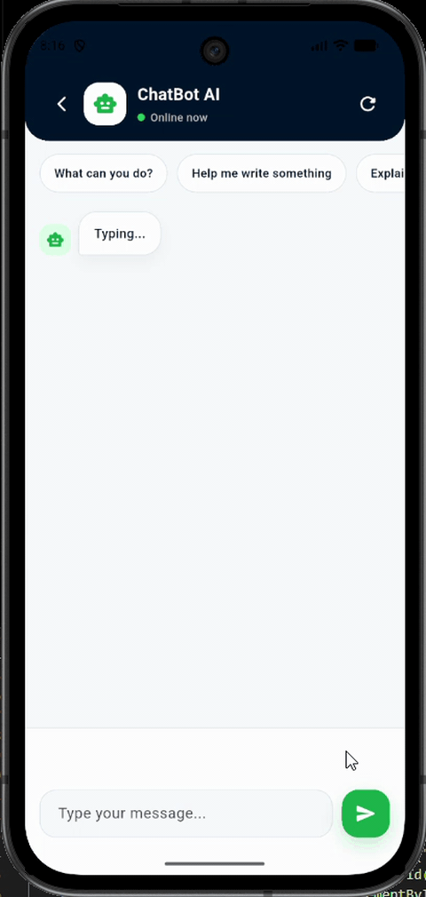

<h1 align="center">Chatbot Mobile App</h1>

  AI-powered chatbot mobile app that can assist customers, take orders, follow instructions, and provide fast conversational support.

  

## Overview

Chatbot Mobile App is a modern Flutter-based mobile application designed to provide a smooth AI chat experience for users. It includes a clean splash screen, registration screen, login screen, home dashboard, and chat interface.

## Features

* AI chatbot-style mobile interface
* Beautiful splash screen with animation
* User registration page
* User login page
* Modern chatbot home screen
* Separate chat page
* Quick question suggestions
* Clean and responsive Flutter UI
* Android and iOS support
* Wear OS support through Android platform

## Tech Stack

* Flutter
* Dart
* Material Design
* GetX ready
* Android
* iOS